# 项目前期调研/竞品分析

## 1、选题方向 

### 1.1 研究目的  

- 调查当前大学生需要哪些服务及对哪些通过服务他人可赚取赏金的业务感兴趣。  
- 为组织和机构提供一个面向当今大学生的、可支持收发问卷等功能的便利平台。  
- 为当代大学生提供一个挣闲钱的云平台。  

### 1.2 市场现状  

- 当前许多机构或组织，如学生会等会针对大学生群体展开一些问卷调查，但通过qq空间、朋友圈等渠道发放问卷较为繁琐，且容易引起他人的反感。  
- 因为课程或实习等原因，许多大学生在快递到来时没有时间去取，此时可以发布悬赏任务委托同校区的同学代取。  
- 目前，微信小程序缺少一个面向大学生的通过做任务挣钱的云平台。  

### 1.3 目标用户  

- 一些组织或机构，称为“奶牛”，他们可提供任务给平台。
- 现代大学生，可通过完成任务获取系统内部的“闲钱币”，“闲钱币”可用于发布任务或提现。  

------

## 2、任务分析  

------

### 2.1 任务选择理念  

- 选择增添一些简单的、能服务同学的任务功能，使得同学们的日常生活更为便利。  
- 个人必须能通过完成任务赚取赏金，用于发布任务或直接提现。  

### 2.2 具体任务分析  

- 问卷调查  

  - 委托者：组织机构或个人（当代大学生）  
  - 接委托者：个人（当代大学生）  
  - 委托方式：委托者在平台发布问卷调查（需提前支付给系统所有的悬赏金），个人可在任务大厅接取任务（业务可被多人接取），当一个人，在完成任务后得到系统发送的悬赏金。  
  - 业务特点：对委托者来说，可以更加便利的发布问卷，更快的得到所需结果；对接委托者来说，可在完成问卷调查的同时赚取赏金。  

- 代取快递   

  - 委托者：个人（当代大学生）  
  - 接委托者：个人（当代大学生）  
  - 委托方式：委托者可以发布悬赏到任务大厅（发布时需支付悬赏金），并说明任务交付的截止时间，接委托者先在大厅接取任务（任务只能被一个人接取，当一个人接取委托后，任务将在大厅消失），完成任务后需要得到委托者的确认方能拿到悬赏金。  
  - 业务特点：委托者可拿到自己没时间去拿的快递，接委托者可以通过顺路帮同学拿快递赚取赏金。  

  ……

## 3、前期调研结果分析

### （1）前期调研目的：

> - 通过前期调研，我们可以初步的了解我们身边的大学生群体对“挣闲钱”的个人看法。这样让我们更加清楚并了解用户需求，并且我们可以按照目前的用户需求来设计并实现应用的相关功能。

### （2）前期调研的途径以及对象：

> - 通过发布在线调查问卷的形式进行调研。调研对象是在校大学生。

### （3）调查问卷结果分析：

> - 我们的调查问卷总共有13个题目，我们发布问卷两天时间，总共收集到90个有效问卷。下面对每一个题目进行统计分析：
>
>   1、请问你的专业是？
>
>   
>
>   2、你是否有发布问卷的经历？
>
>   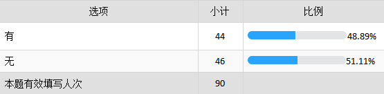
>
>   3、如果你曾发布过问卷，回收的平均数目有多少？
>
>   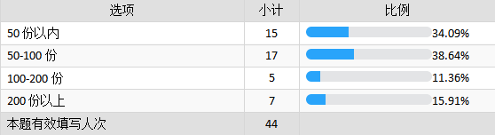
>
>   4、你在朋友圈中遇到需要帮忙填问卷的情况的频率？
>
>   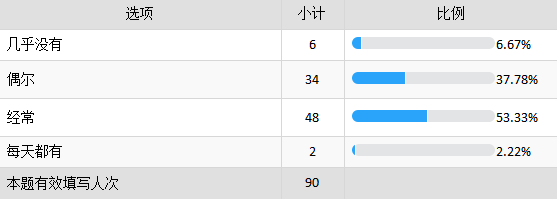
>
>   5、当你遇到别人请求填问卷的情况，你会？
>
>   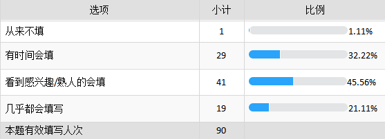
>
>   6、如果填写问卷可以获得一定报酬，会提高你的填写意愿吗？
>
>   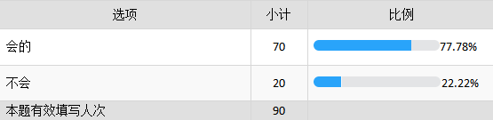
>
>   7、 如果你可以通过填问卷（或者其他一些劳动）获得一定的报酬，你希望是通过哪些形式？
>
>   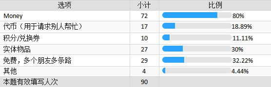
>
>   8、如果酬劳是money，你会把挣闲钱看作是生活补贴的来源之一吗？
>
>   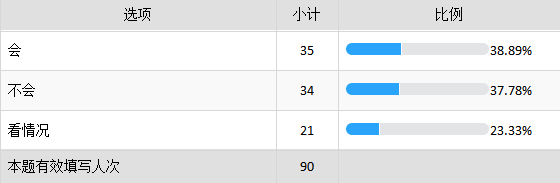
>
>   9、如果酬劳是虚拟代币，是否会对你参加此类活动的积极性产生消极影响？
>
>   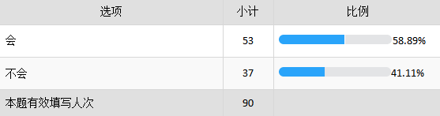
>
>   10、大学生活中，除了帮忙填写问卷，你还希望通过哪些方式获得一定的报酬？
>
>   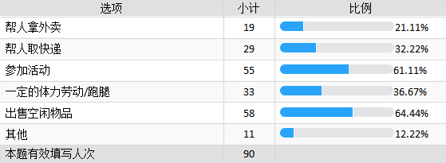
>
>   11、大学生活中，除了找人填写问卷，对于以下哪种生活便利你愿意提供一定的酬劳？
>
>   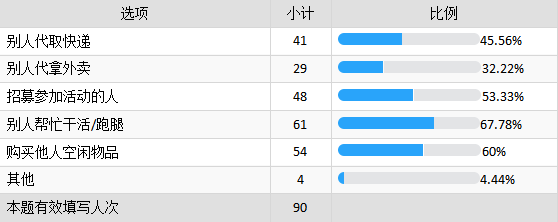
>
>   12、你是否愿意为了发布/参加上述活动的真实性透露个人信息（实名/联系方式等）？
>
>   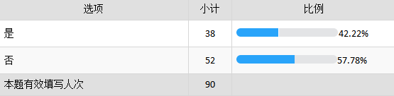
>
>   13、如果有一个平台可以向大学生提供上述服务（可以发布/参加），你对平台的使用频率会是怎样？
>
>   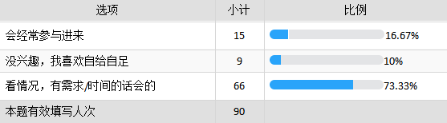
>
>
>
>   - 通过调研结果分析，我们可以分析出如果有一定的报酬的话大部分同学表示刚乐意填写问卷，并且大部分学生表示报酬的形式现金的形式会更好，除了调查问卷以外还有其他的帮忙拿外卖、拿快递、参加活动、购买空闲物品等都有一些兴趣。还有同学们也乐意给别人一定的酬劳帮忙他代取快递、外卖，还有帮忙跑腿等方面。如果有类似的平台同学们也表示在空余时间的情况下做一做，其中约1/3的同学觉得通过这个方式可以赚零花钱，可以作为生活补贴的一部分，其中约1/3的同学觉得不会把这件事儿作为生活费的来源之一，其他的同学表示不太确定，看情况。总之，通过这次调研用户需求方面我们了解的更加清楚了，按照这些学生的需求情况，应用程序中我们会设计并实现相关的功能。

